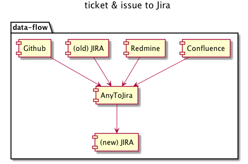

# About

The script migrating from Confluence table, JIRA ticket, Redmine issue, and Github issue to JIRA.



# Component


# Install

Execute this command after setting ruby and bundler.

```
bundle install --path=vendor/bundle
```

```
cp ./.env.template ./.env
```

Write down environment variables to ./.env file.

# Usage

Execute this command after canceling comment in ./main.rb file.

```
bundle exec ruby ./main.rb
```

# Contribute

use static code analysis before commit

```
bundle exec rake rubocop
bundle exec rake rubocop:auto_correct
bundle exec rubocop --auto-gen-config

# => make source code better!
```
